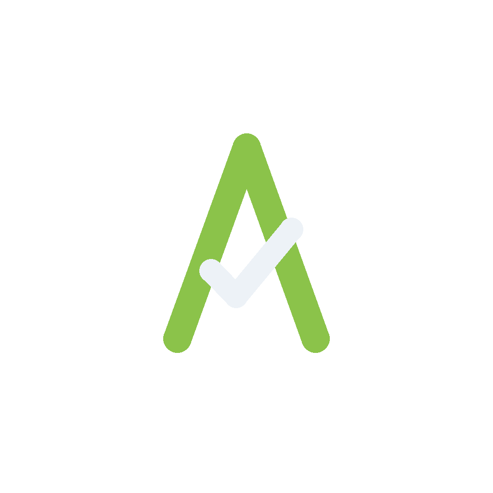
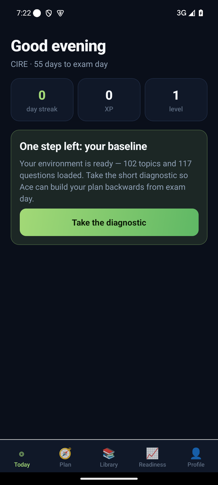
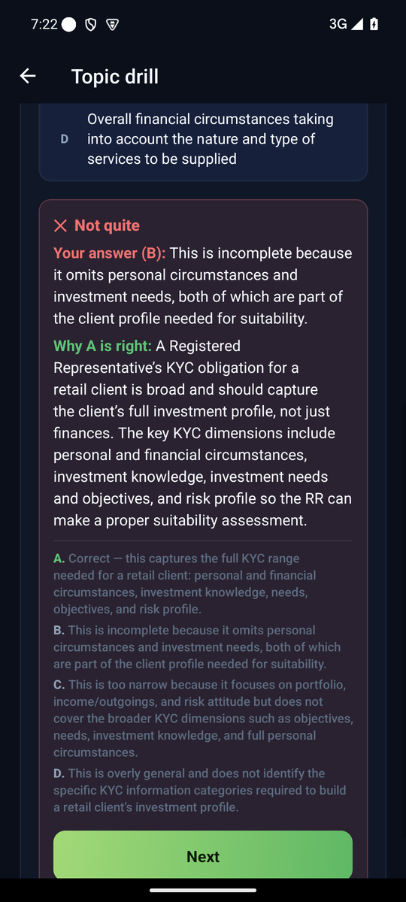
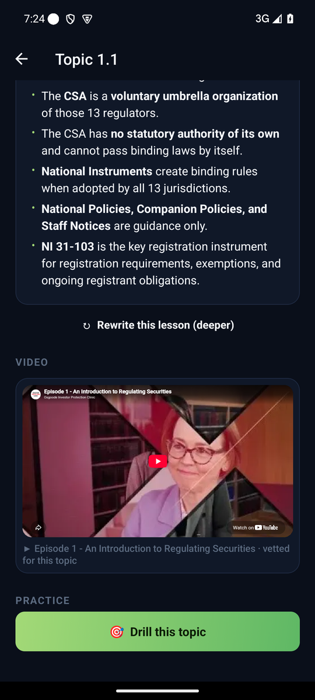
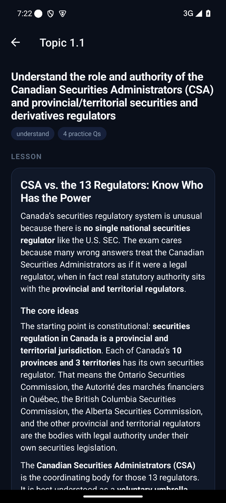
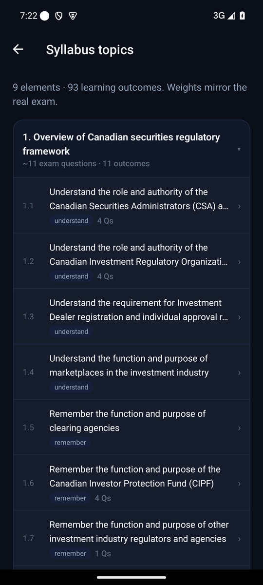
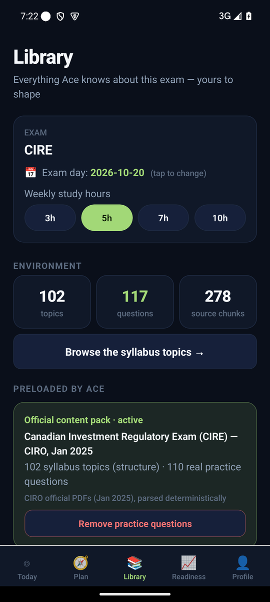
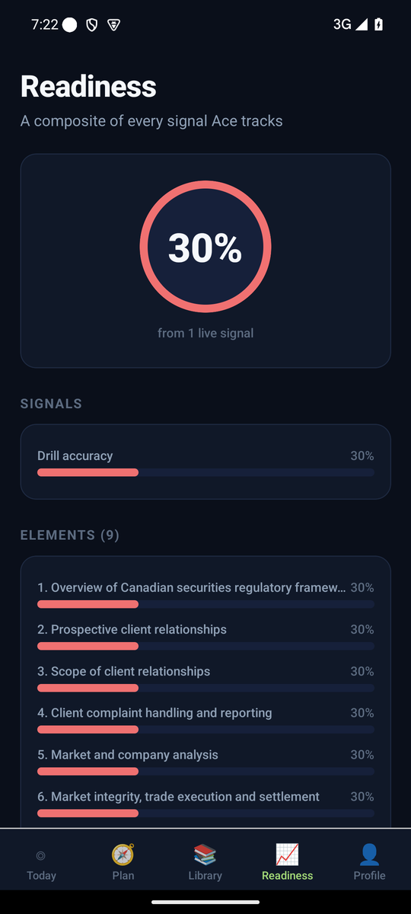
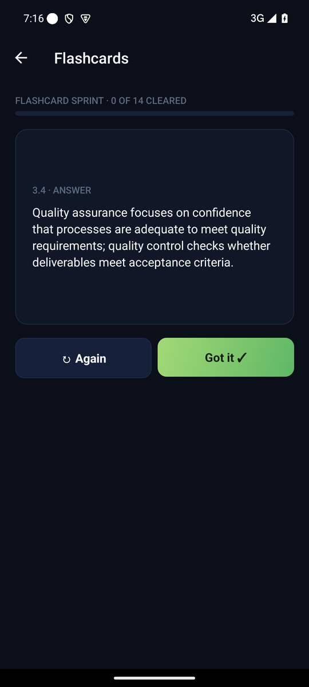

<p align="center">
  
</p>

<h1 align="center">Ace</h1>

<p align="center"><b>Upload your materials. Set your date. Ace runs your entire exam prep.</b></p>

<p align="center">
  
  
  
</p>

---

Professional exam candidates — accounting, finance, project management, tech certifications —
keep failing the same three ways:

1. **No plan, just materials.** A 900-page textbook, a syllabus PDF, and 11 weeks. Nobody
   turns that into *"what do I do for 45 minutes today?"*
2. **Static practice.** Question banks don't adapt. Candidates grind topics they already
   know and avoid the ones they're weak in.
3. **No feedback on readiness.** Most people walk into the exam hall with no calibrated
   sense of whether they'd pass today. Anxiety fills the gap.

Ace is an agent that owns the whole cycle. Your only job is to show up for today's
session — **Ace decides what today's session is.**

## The Ace Loop

1. **Onboard** — name your exam (*any* exam), set the date, upload the materials you own.
2. **Diagnose** — a short baseline test maps where you actually stand, topic by topic.
3. **Plan** — a day-by-day schedule built *backwards from exam day*, weighted by how the
   real exam weighs each topic and where you're weakest.
4. **Drill** — daily mixed-media sessions: a written micro-lesson, a vetted YouTube video,
   then practice questions in the same formats your real exam uses.
5. **Measure** — a live readiness score from multiple signals: drill accuracy, mock exams,
   confidence calibration, spaced recall.
6. **Re-plan** — every night, the agent reshuffles what remains: more reps where you're
   stuck, mock exams at the right milestones, taper before the big day.

## Wrong answers are the product

Every answer — right or wrong — explains itself: why *your* pick fails, why the correct
one is right, and a one-line verdict on every option, grounded in your study materials.
Getting a question wrong in Ace is the most instructive thing you can do.

<p align="center">
  
  
  
</p>

## Every topic is a destination

The syllabus isn't a list — it's a map you can walk. Tap any of the ~100 topics and get:

- a **proper written lesson** (core ideas, a worked scenario, "how the exam tests this",
  recall bullets) — written on demand from your materials, rewritten deeper on request;
- a **YouTube video vetted for that exact topic** — searched, judged for relevance by an
  LLM, checked for embeddability, playable in-app;
- a **drill** scoped to that topic, available anytime.

## Your materials are the source of truth

Everything Ace generates — questions, lessons, explanations, flashcards — must cite the
materials *you* uploaded. That keeps content on-syllabus by construction and your
documents private to you. The Library shows every source feeding your environment, and
every one of them is removable, including what Ace preloaded.

No materials at all? For well-known exams Ace writes a clearly-labeled **starter pack**
from its own knowledge — a topic map, study notes, and seed questions — so you can start
today and upload the real thing later.

## An agent that keeps working while you sleep

Every night, unattended: reported questions get replaced, older content is re-audited
against a strict critic (draft → judge → revise → accept/kill), thin lessons are
rewritten, under-stocked topics get new questions, missing videos get curated, and every
question gains why-right/why-wrong notes. The content you see tomorrow is better than
the content you saw today.

<p align="center">
  
  
</p>

## Honest about readiness — and fun enough to open daily

The readiness score is a composite of real signals — not a completion percentage. Mock
exams mirror your real paper's element weighting and timing. Confidence tags on every
answer expose the most dangerous topics: the ones you're *confidently wrong* about.
Streaks, XP, mastery badges and daily quests keep it moving — adult-toned, every
mechanic skippable, and the only leaderboard is the exam itself.

---

## Under the hood

FastAPI + Postgres/pgvector backend, Expo/React Native Android app, any OpenAI-compatible
LLM endpoint. Grounding, citation and answer-leak protections are enforced in code, not
prompts; 55 tests cover end-to-end journeys, cross-user isolation, and an
"empty exam never 500s" sweep. Self-hosted by design.

- Product thinking: [docs/CONCEPT.md](docs/CONCEPT.md) · [docs/PRD.md](docs/PRD.md)
- Build details: [docs/IMPLEMENTATION_PLAN.md](docs/IMPLEMENTATION_PLAN.md) · [docs/DEVICE_BUILD.md](docs/DEVICE_BUILD.md)

```bash
make db-up migrate                        # postgres+pgvector (docker, :5445)
cp apps/api/.env.example apps/api/.env    # point at your LLM endpoint
make dev                                  # API on :8040
cd apps/mobile && npm install && npm start
```

Study materials are **bring-your-own** (`resources/` stays local and untracked — the
corpus that powers the screenshots above is copyrighted courseware). Drop an exam's
official PDFs there and `make accelerate` builds the full environment.

MIT licensed. Built as a working personal product and dogfooded against a real
certification — not a hosted service.
